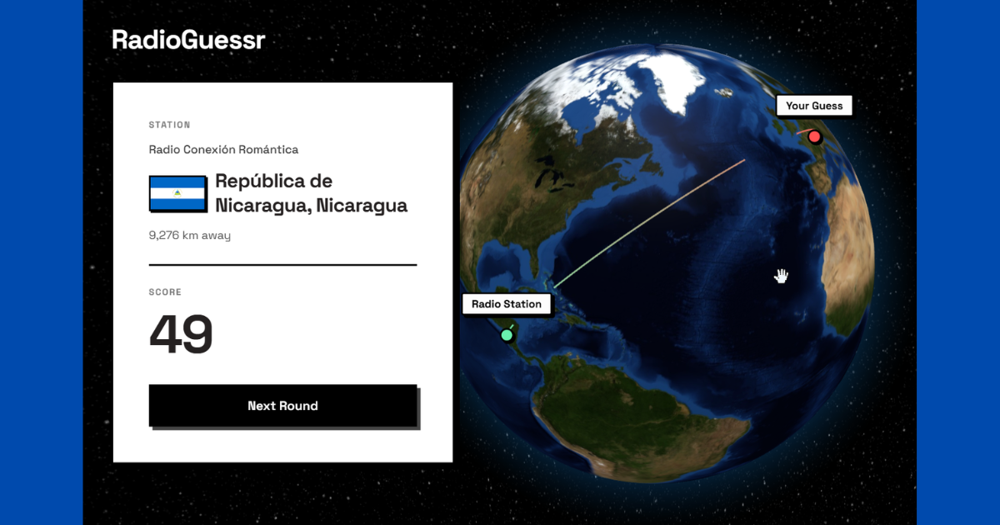
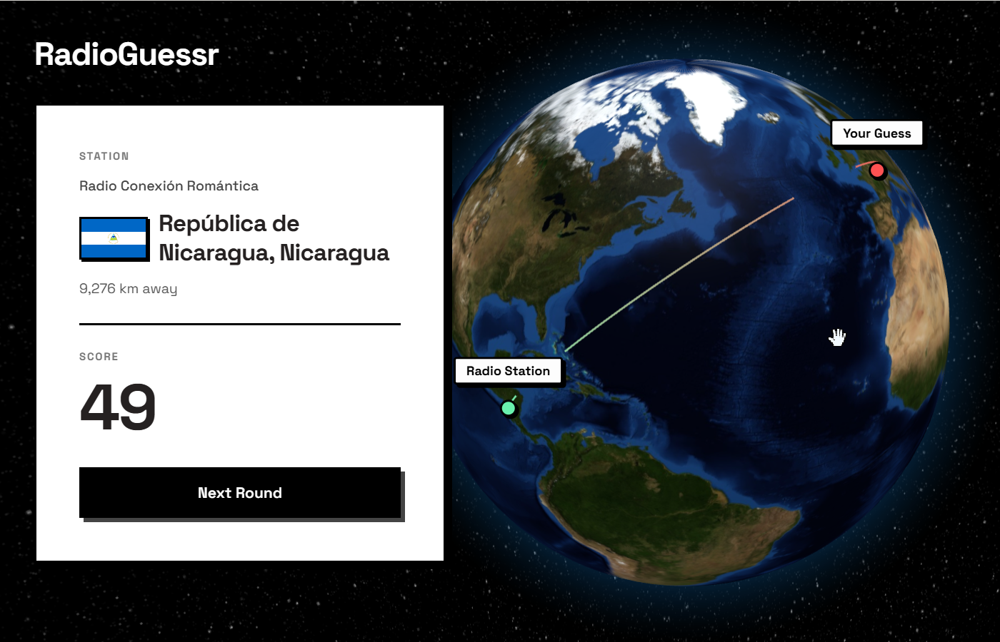

# 📻 RadioGuessr

A GeoGuessr-style game where you tune into live radio streams from around the world and test your geography skills by guessing their broadcasting location on an interactive 3D globe.

<p align="center">
  
</p>

## ✨ Features

- **Global Radio Exploration**: Listens to authentic, live radio streams served dynamically via the Radio Browser API.
- **Interactive 3D Globe**: Spin, pan, and drop pins on a responsive, fully customized `globe.gl` powered 3D Earth.
- **Multiple Visual Themes**: Customize your globe aesthetic with themes including Blue Marble, Day Map, Water Map, and Night Map.
- **Progressive Rounds**: Play 5 rounds per session with an intuitive, collapsible Round Score Tracker to monitor your performance.
- **Hints System**: Stuck on a tricky stream? Reveal the broadcasting language for an easier guess.
- **Premium Neobrutalist UI**: A highly refined, animated interface built with Tailwind CSS and Framer Motion for a dynamic, satisfying game loop.
- **Session History Summary**: At the end of 5 rounds, review the countries you've "visited", complete with country flags seamlessly pulled from FlagCDN with custom styled tooltips.

## 🛠️ Tech Stack

- **Core**: React 19 + Vite
- **Styling**: Tailwind CSS (v4)
- **3D Rendering**: Three.js & Globe.gl
- **Animations**: Framer Motion
- **Icons**: Lucide React
- **Audio Handling**: Native HTML5 Audio & HLS.js
- **APIs**:
  - [Radio Browser API](https://de1.api.radio-browser.info) for random, geo-located radio streams
  - [FlagCDN](https://flagcdn.com) for rendering vector country flags

## 🚀 Getting Started

### Prerequisites

Ensure you have [Node.js](https://nodejs.org/) installed along with standard package managers.

### Installation

1. Navigate to the project directory:
   ```bash
   cd RadioGuessr
   ```

2. Install dependencies:
   ```bash
   npm install
   ```

3. Start the development server:
   ```bash
   npm run dev
   ```

4. Open your browser and navigate to the local server (usually `http://localhost:5173`).

## 🎮 How to Play

1. Click the **Play** button and wait for a live radio stream to connect.
2. Listen closely to the audio, music styles, language, or geographical context clues. (You can click "Reveal Hint?" to gently uncover the language being spoken).
3. Pan, rotate, and zoom the 3D globe to navigate the world.
4. **Click directly on the globe** to drop your coordinate pin and click **Submit Guess**.
5. See how close you were! The closer your pin is to the actual physical radio station, the higher your score.
6. Play through all 5 rounds to evaluate your Final Score and explore your visited countries profile.

## 📸 Screenshots

<p align="center">
  
</p>

## 🤝 Acknowledgements

- Built around the incredible open-source community-driven [Radio Browser API](https://www.radio-browser.info/).
- Continually refined based on UI/UX optimization for the best interactive web experience.
- [FlagCDN](https://flagcdn.com) for rendering vector country flags
- Built with ❤️ by [Sparsh](https://github.com/barryspacezero)

---

*Game Version: 1.3*
