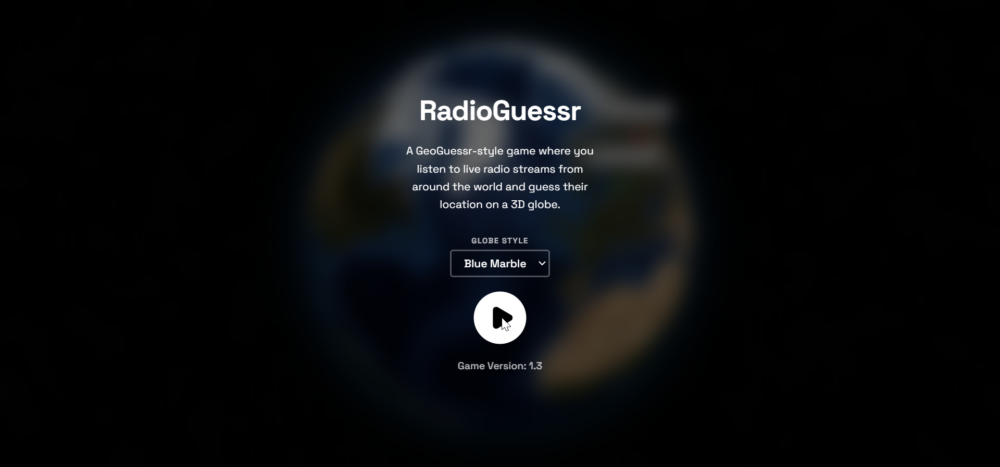
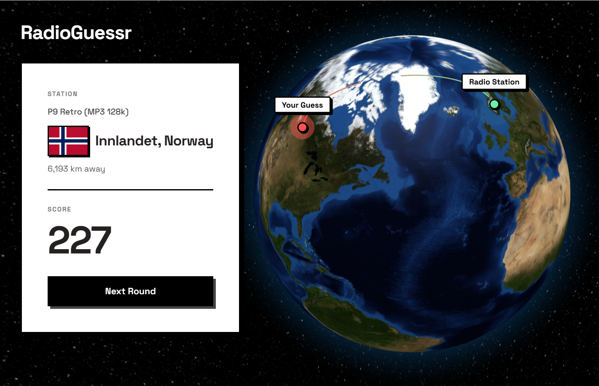

# 📻 RadioGuessr

A GeoGuessr-style game where you tune into live radio streams from around the world and test your geography skills by guessing their broadcasting location on an interactive 3D globe.

<p align="center">
  
</p>

## ✨ Features

- **Global Radio Exploration**: Listens to authentic, live radio streams served dynamically via the Radio Browser API.
- **Curated High-Quality Stations**: Stream search natively prioritizes high-voted music and talk stations, automatically filtering out noise/ambiance.
- **Interactive 3D Globe**: Spin, pan, and drop pins on a responsive, fully customized `globe.gl` powered 3D Earth, now enriched with optional TopoJSON country borders and interactive hover labels.
- **Multiple Visual Themes**: Customize your globe aesthetic with themes including Blue Marble, Day Map, Water Map, and Night Map.
- **Progressive Rounds**: Play 5 rounds per session with an intuitive, collapsible Round Score Tracker to monitor your performance.
- **Hints System**: Stuck on a tricky stream? Request the broadcasting Language, City/State, or Region for an easier guess, featuring intelligent fallback mechanisms for missing API data.
- **Intelligent Station Rerolls**: Encounter a broken, slow, or silent stream? Use the **Reroll (Same Country)** escape hatch during the loading or playing phases to seamlessly fetch a different station from the same country.
- **Keep Listening**: Submitting a guess automatically pauses the stream, letting you **keep listening** to your current station, or click to switch to a new one from the same country.
- **Enhanced Mobile UI**: A highly refined, animated interface built with Tailwind CSS and Framer Motion, featuring smart collapsing cards and persistently pinned buttons for a flawless mobile guessing experience.
- **Session History Summary**: At the end of your game, review the countries you've "visited", complete with country flags seamlessly pulled from FlagCDN with custom styled tooltips.
- **Talk Mode (v1.6)**: Automatically filters out music stations in favor of news, talk, and public radio to make language guessing easier.
- **Customizable Rounds (v1.6)**: Choose to play 3, 5, 10, or 20 rounds per session, with hints automatically scaling to your chosen round length.
- **Stream Pooling & Silent Fallbacks (v1.6)**: The engine intelligently fetches pools of up to 100 stations at once. If a stream is broken or blocked by CORS, it silently skips to the next working station in the pool without interrupting your gameplay.

## 🛠️ Tech Stack

- **Core**: React 19 + Vite
- **Styling**: Tailwind CSS (v4)
- **3D Rendering**: Three.js & Globe.gl
- **Animations**: Framer Motion
- **Icons**: Lucide React
- **Audio Handling**: Native HTML5 Audio & HLS.js
- **APIs**:
  - [Radio Browser API](https://de1.api.radio-browser.info) for random, geo-located radio streams
  - [FlagCDN](https://flagcdn.com) for rendering vector country flags

## 🚀 Getting Started

### Prerequisites

Ensure you have [Node.js](https://nodejs.org/) installed along with standard package managers.

### Installation

1. Navigate to the project directory:
   ```bash
   cd RadioGuessr
   ```

2. Install dependencies:
   ```bash
   npm install
   ```

3. Start the development server:
   ```bash
   npm run dev
   ```

4. Open your browser and navigate to the local server (usually `http://localhost:5173`).

## 🎮 How to Play

1. Click the **Play** button and wait for a live radio stream to connect.
2. Listen closely to the audio, music styles, language, or geographical context clues. (You can click "Reveal Hint?" to gently uncover the language being spoken).
3. Pan, rotate, and zoom the 3D globe to navigate the world.
4. **Click directly on the globe** to drop your coordinate pin and click **Submit Guess**.
5. See how close you were! The closer your pin is to the actual physical radio station, the higher your score.
6. Play through all your selected rounds to evaluate your Final Score and explore your visited countries profile.

## 📸 Screenshots

<p align="center">
  
</p>

## 🤝 Acknowledgements

- Built around the incredible open-source community-driven [Radio Browser API](https://www.radio-browser.info/).
- [Globe.gl](https://globe.gl) for an excellent 3D globe library.
- [FlagCDN](https://flagcdn.com) for rendering vector country flags.
- Built with ❤️ by [Sparsh](https://github.com/barryspacezero)

---

*Game Version: 1.6*
